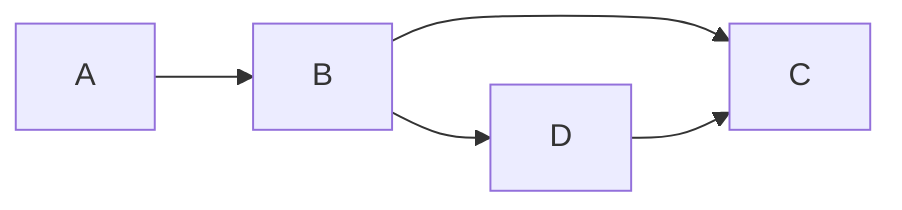
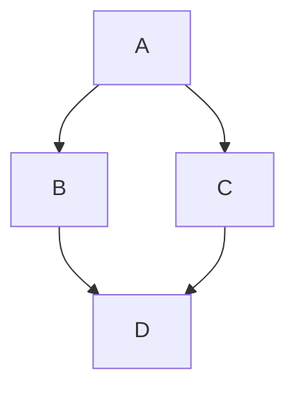
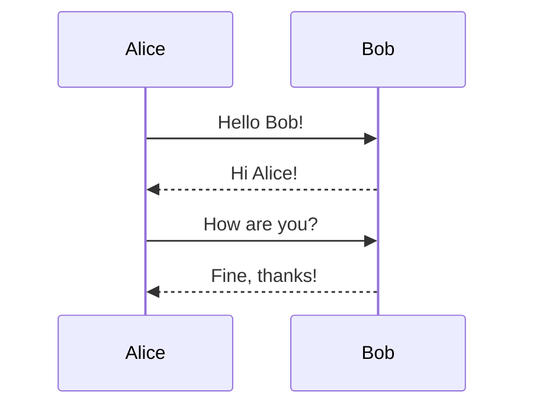

# mermaid-draw テスト用サンプル

## フローチャート (LR)

```mermaid
graph LR
A --> B --> C
B --> D
D --> C
```

## フローチャート (TD)

```mermaid
graph TD
A --> B
A --> C
B --> D
C --> D
```

## シーケンス図

```mermaid
sequenceDiagram
Alice->>Bob: Hello Bob!
Bob-->>Alice: Hi Alice!
Alice->>Bob: How are you?
Bob-->>Alice: Fine, thanks!
```