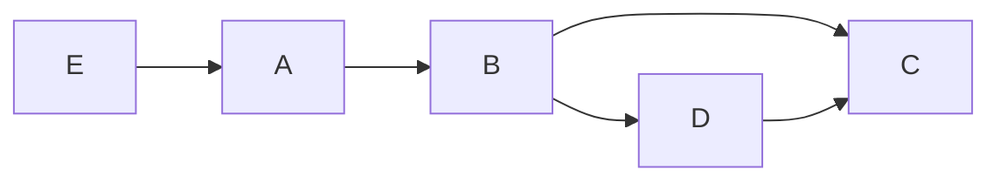
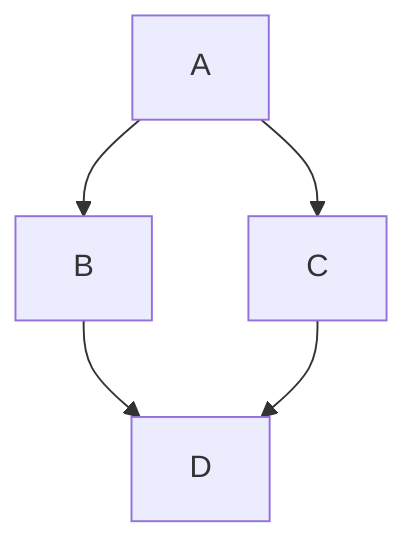
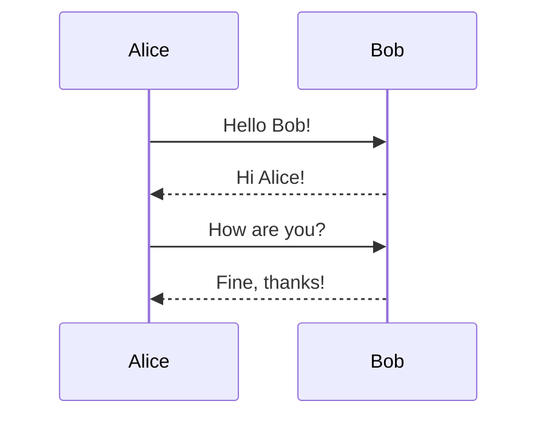
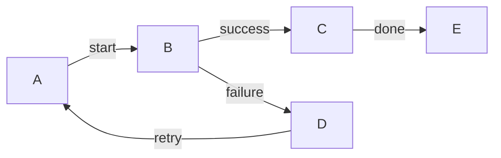
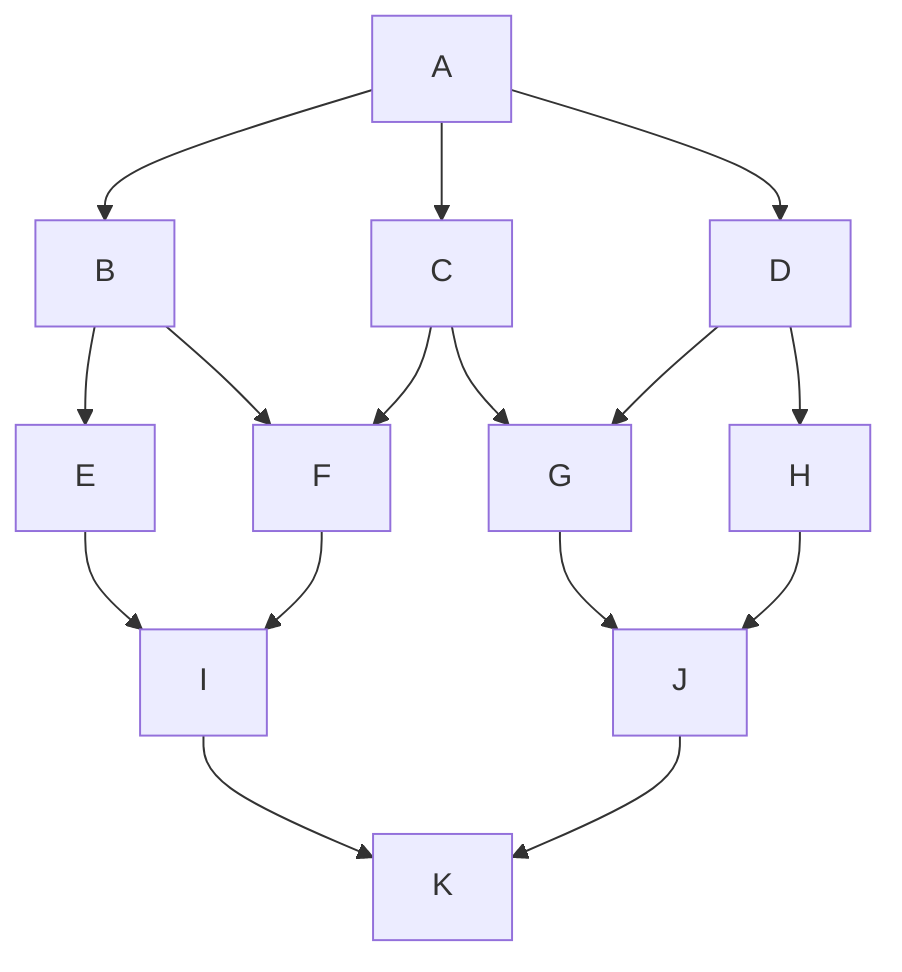
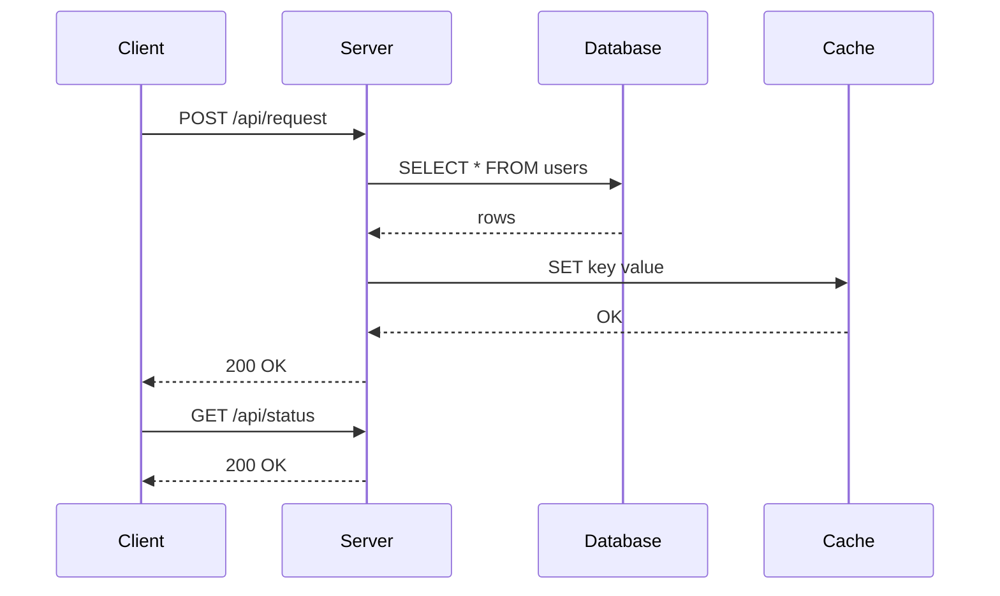
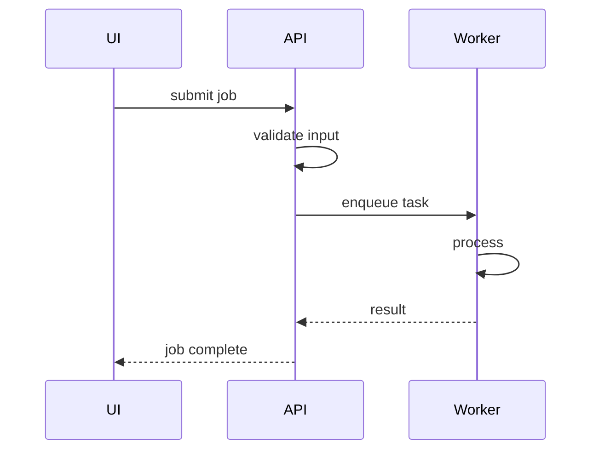

# mermaid-draw Test Samples

## Flowchart (LR)

## Flowchart (TD)

## Sequence Diagram

## Labeled Edges

## Complex Flowchart (Multiple Paths)

## Complex Sequence Diagram (3-Party Communication)

## Self Messages + Multiple Participants

