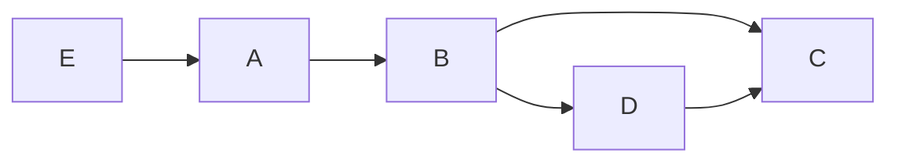
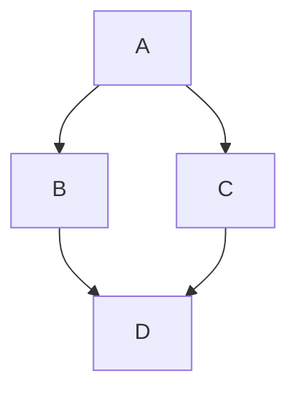
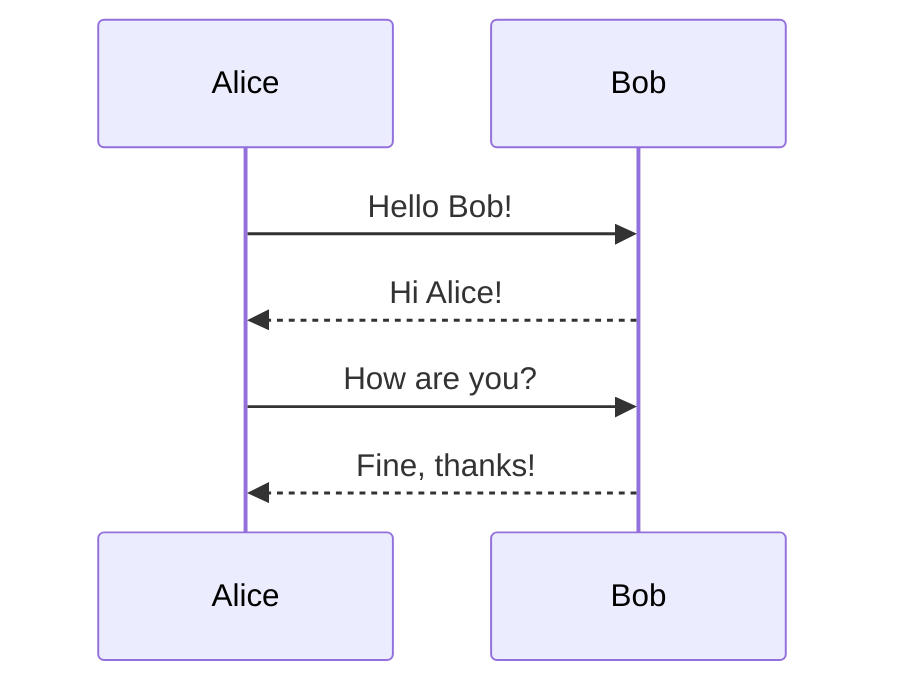
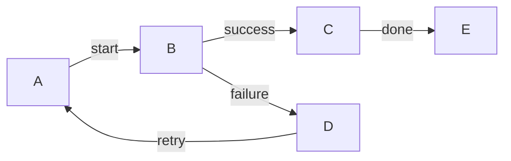
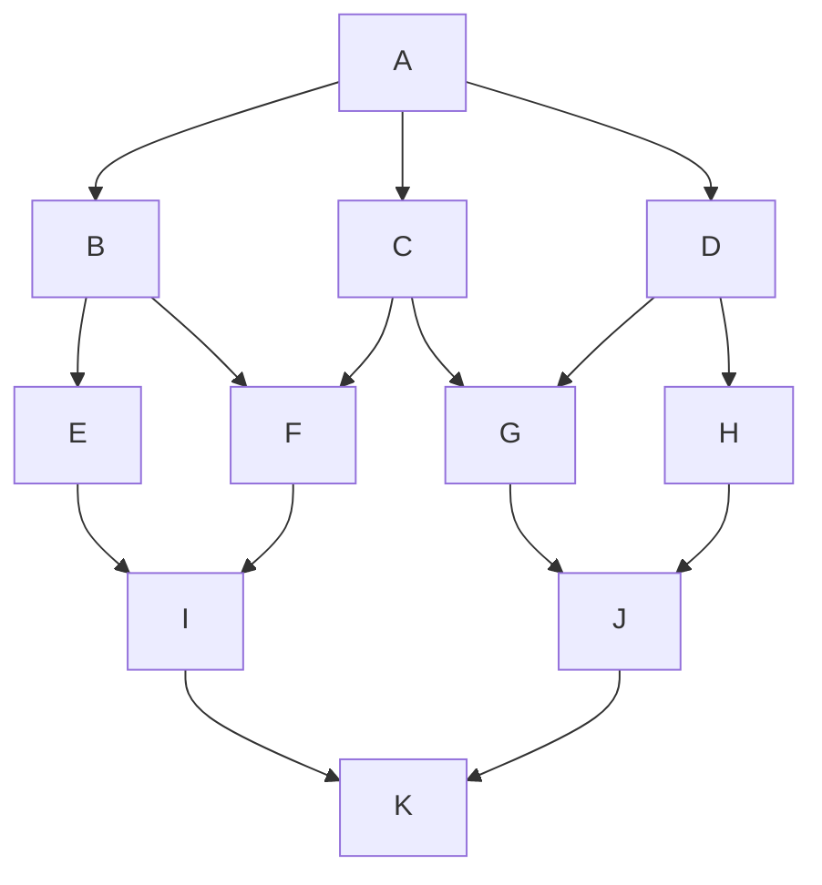
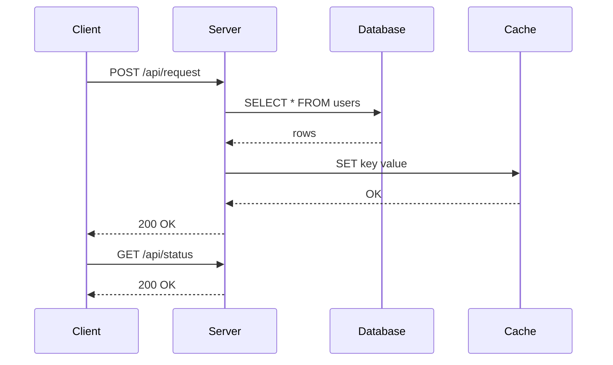
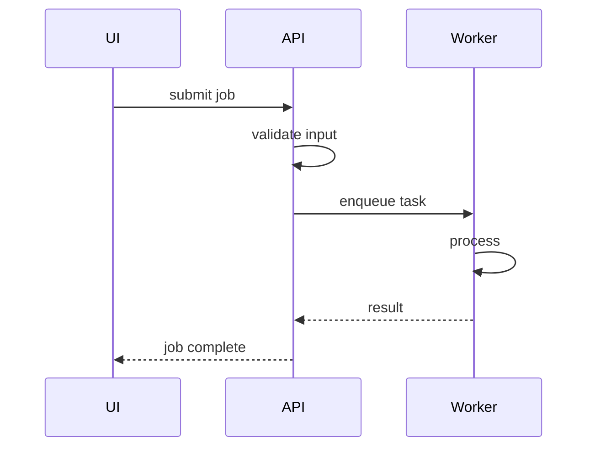

# mermaid-draw テスト用サンプル

## フローチャート (LR)

```mermaid
graph LR
A --> B --> C
B --> D
D --> C
E --> A
```

## フローチャート (TD)

```mermaid
graph TD
A --> B
A --> C
B --> D
C --> D
```

## シーケンス図

```mermaid
sequenceDiagram
Alice->>Bob: Hello Bob!
Bob-->>Alice: Hi Alice!
Alice->>Bob: How are you?
Bob-->>Alice: Fine, thanks!
```

## ラベル付きエッジ

```mermaid
graph LR
A -->|start| B
B -->|success| C
B -->|failure| D
D -->|retry| A
C -->|done| E
```

## 複雑なフローチャート（複数パス）

```mermaid
graph TD
A --> B
A --> C
A --> D
B --> E
B --> F
C --> F
C --> G
D --> G
D --> H
E --> I
F --> I
G --> J
H --> J
I --> K
J --> K
```

## 複雑なシーケンス図（3者間通信）

```mermaid
sequenceDiagram
Client->>Server: POST /api/request
Server->>Database: SELECT * FROM users
Database-->>Server: rows
Server->>Cache: SET key value
Cache-->>Server: OK
Server-->>Client: 200 OK
Client->>Server: GET /api/status
Server-->>Client: 200 OK
```

## セルフメッセージ + 複数参加者

```mermaid
sequenceDiagram
participant UI
participant API
participant Worker
UI->>API: submit job
API->>API: validate input
API->>Worker: enqueue task
Worker->>Worker: process
Worker-->>API: result
API-->>UI: job complete
```